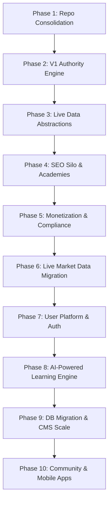

# PriceLot Master Engineering Execution Roadmap

This document serves as the master execution plan for the development, scaling, and long-term evolution of the PriceLot financial education and market intelligence platform. It outlines the chronological phases required to move from the current MVP structure to an enterprise-grade global financial knowledge graph, ordered to minimize rework and preserve architectural integrity.

---

## Roadmap Overview & Dependency Graph

---

## Detailed Execution Phases

### Phase 1: Repository Consolidation & Toolchain Cleanup (Immediate Priority)
* **Objective**: Remove the duplicate legacy React/Vite SPA (`src/`) and associated configuration tools to reduce bundle footprint, resolve Tailwind build conflicts, and lock the Next.js App Router as the single source of truth.
* **Dependencies**: None.
* **Deliverables**:
  * Delete the deprecated `src/` directory.
  * Delete legacy configuration files: `vite.config.ts`, `index.html`.
  * Clean up `package.json` to remove Vite-specific devDependencies.
  * Consolidate dual implementations of components (e.g., navigation, footer) and hooks (e.g., analytics hooks) into standard locations under `app/`.
* **Definition of Done**: 
  * `npm run lint` and `npm run build` run successfully with zero errors.
  * No references to the `src/` directory remain.
  * The development command `npm run dev` starts the application without configuration collisions.
* **Estimated Complexity**: **Low**

---

### Phase 2: V1 Authority Engine (EEAT & Legal Trust)
* **Objective**: Establish the technical foundations for search engine trust (Experience, Expertise, Authoritativeness, and Trustworthiness) and legal disclaimer compliance before scaling academy content.
* **Dependencies**: Phase 1.
* **Deliverables**:
  * Define TypeScript interfaces and schemas for Authors, Contributors, Reviewers, and Editorial Policy.
  * Implement dedicated profile routes: `/authors/[id]`, `/about`, `/contact`, `/editorial-standards`.
  * Add static pages for disclosures: `/affiliate-disclosure`, `/privacy-policy`, `/terms-of-service`, `/risk-disclaimer`.
  * Inject Google Schema JSON-LD markup (`Article`, `DefinedTerm`, `NewsArticle`, `Review`) dynamically referencing author profiles and last-reviewed timestamps on all content pages.
  * Place permanent global disclaimers in layout footers and tools pages.
* **Definition of Done**: 
  * All legal disclaimers and policy links are clearly visible site-wide.
  * Google Rich Results Test passes with zero warnings for Article and Author schemas.
  * Dynamic breadcrumbs are generated correctly across all nested pages.
* **Estimated Complexity**: **Medium**

---

### Phase 3: Live Data Abstractions & Caching Engine
* **Objective**: Build a provider-agnostic data service layer and in-memory serverless-friendly caching system to ensure calculators and calendar routes are ready to transition from static seeds to live feeds.
* **Dependencies**: Phase 2.
* **Deliverables**:
  * Define abstract interfaces for financial data points (EconomicEvent, HeatmapCell, CurrencyRate, MarketSession).
  * Build a central service connector (`app/lib/services/dataConnector.ts`) that manages active data providers.
  * Implement an incremental revalidation and caching mechanism on the server-side API routes (`app/api/`) to cache results (e.g., 5-minute CDN caching) and protect external rate limits.
  * Build mock-to-live toggle adapters allowing developers to swap data providers in a single environment configuration.
* **Definition of Done**:
  * `/api/economic-calendar` and `/api/market-sessions` serve data using the provider-agnostic service connectors.
  * Caching headers are correctly set in the responses.
  * Swap from mock to live feed requires changing only environment variables without code refactoring.
* **Estimated Complexity**: **Medium**

---

### Phase 4: SEO Silo & Academy Expansion (V1 Launch Ready)
* **Objective**: Complete all core educational content hubs (Forex, Gold, Crypto, Indices, Commodities, Stocks, Investing, Personal Finance) and implement localized full-text indexing for glossary entries.
* **Dependencies**: Phase 3.
* **Deliverables**:
  * Complete full academies for each asset class, linking lesson pathways progressively.
  * Add automatic page-level pagination (`rel=prev/next`) and categorization indices for news and articles.
  * Implement a client-side search overlay indexing glossary terms dynamically.
  * Programmatic generation of section-specific XML sitemaps and RSS/Atom feeds for news updates.
* **Definition of Done**:
  * All 8 core academy hubs are fully navigable with zero broken internal links.
  * Google Lighthouse SEO score ranks at 100%.
  * Dynamic XML sitemaps compile successfully during `npm run build`.
* **Estimated Complexity**: **High**

---

### Phase 5: Monetization Foundation & Performance Budgeting
* **Objective**: Wire visual ad-slot placeholders, configure broker affiliate links handlers, and apply web performance budgets to satisfy Core Web Vitals (CWV).
* **Dependencies**: Phase 4.
* **Deliverables**:
  * Implement a redirection controller page (`/compare/go/[brokerId]`) for affiliate link tracking and redirection compliance.
  * Integrate premium display ad placeholder layouts styled with CSS to avoid layout shift (CLS).
  * Build a custom GDPR/CCPA-compliant cookie consent banner with state persistence.
  * Apply image optimization (`next/image`) and lazy-loading rules for heavy charts and interactive calculators.
* **Definition of Done**:
  * Cumulative Layout Shift (CLS) scores less than 0.05 on both mobile and desktop.
  * Google Lighthouse performance score is greater than 90 on mobile.
  * Affiliate links dynamically redirect through safe compliance routes.
* **Estimated Complexity**: **Medium**

---

### Phase 6: Live Market Data Migration (Version 2)
* **Objective**: Transition the dashboards (Economic Calendar, Heat Maps, Currency Strength, Session Clocks) from mock/static seeds to production-grade external financial data APIs.
* **Dependencies**: Phase 3, Phase 5.
* **Deliverables**:
  * Integrate API connections (e.g., Twelve Data, Finnhub, or Alpha Vantage) using the service wrapper created in Phase 3.
  * Implement dynamic server-side pricing endpoints to feed calculators and charts.
  * Establish API rate-limiting guardrails and database fallback triggers to prevent API cost overruns.
* **Definition of Done**:
  * Dashboard indicators update with live values.
  * Server-side logs confirm caching layer catches 90%+ of rate-limited API calls.
  * Zero exposure of private API credentials to client components.
* **Estimated Complexity**: **High**

---

### Phase 7: User Platform & Personalization Engine (Version 2)
* **Objective**: Enable user account registrations, dashboard profiles, personal strategy templates, and tracking of course progress to improve retention.
* **Dependencies**: Phase 6.
* **Deliverables**:
  * Integrate authentication (e.g., NextAuth, Supabase Auth, or Clerk).
  * Create database tables for User, Profile, ProgressTracker, SavedTools, and PersonalTradingJournal.
  * Build the user profile UI and a dashboard showing course completion percentages and bookmarked glossary entries.
  * Set up email capture forms synced with automated marketing/retention integrations (e.g., Mailchimp or ConvertKit).
* **Definition of Done**:
  * Users can register, log in, manage profiles, and track course lesson completion.
  * Saved preferences are persisted securely and fetched efficiently.
* **Estimated Complexity**: **High**

---

### Phase 8: AI-Powered Learning Engine (Version 3)
* **Objective**: Deploy `@google/genai` (Gemini) features, including interactive financial tutors, lesson quiz generators, and contextual explanations grounded in PriceLot's database.
* **Dependencies**: Phase 7.
* **Deliverables**:
  * Configure server-side API controllers for Gemini model interactions.
  * Develop context-grounding middleware that automatically injects relevant glossary terms and academy content into the LLM system prompt.
  * Build the dynamic "Quiz Me" feature on lesson pages, grading responses and providing pedagogical explanations.
  * Deploy a persistent floating "Ask PriceLot AI" helper panel site-wide.
* **Definition of Done**:
  * AI assistant successfully answers financial questions using groundings from PriceLot databases first.
  * Rate-limits are enforced per user account to control token expenditure.
  * Fallbacks prevent response generation when queries request direct financial advice.
* **Estimated Complexity**: **Very High**

---

### Phase 9: Scale-Minded Database Migration & CMS
* **Objective**: Move all static database seed files (`app/data.ts`) to a production PostgreSQL database mapped via Prisma ORM, and configure a Headless CMS (e.g., Strapi, Sanity) for editorial workflows.
* **Dependencies**: Phase 8.
* **Deliverables**:
  * Setup Prisma schemas matching the data structures for academies, authors, reviews, and terms.
  * Migrate static arrays into PostgreSQL tables.
  * Implement server-side caching (e.g., Redis) to keep queries lightning fast.
  * Hook up a headless CMS allowing authors to publish news and create glossary definitions dynamically.
* **Definition of Done**:
  * All static content pages are successfully generated dynamically from database fetches.
  * Production database queries average less than 50ms response times.
  * CMS editor interface is active and successfully syncs content to the database.
* **Estimated Complexity**: **High**

---

### Phase 10: Community Forum & Mobile Applications (Enterprise Scaling)
* **Objective**: Launch native mobile applications (iOS/Android) and community social features (discussions, trading journal sharing, peer strategy reviews) to lock in market dominance.
* **Dependencies**: Phase 9.
* **Deliverables**:
  * Develop mobile app wrappers using React Native/Expo, sharing business logic and assets.
  * Deploy real-time community boards with user-generated posts and review threads.
  * Build out prop-firm prep tracking and shared peer strategy dashboards.
* **Definition of Done**:
  * Native apps are compiled and tested on iOS/Android simulators.
  * Discussion boards feature community reporting and automated moderation triggers.
* **Estimated Complexity**: **Very High**

---

## Summary Table

| Phase | Title | Objective | Est. Complexity |
| :--- | :--- | :--- | :--- |
| **Phase 1** | Repo Consolidation | Clean legacy/Vite SPA and duplicate assets | Low |
| **Phase 2** | V1 Authority Engine | Establish authoritativeness (EEAT) and disclaimers | Medium |
| **Phase 3** | Data Abstractions | Build provider-agnostic service and caching layers | Medium |
| **Phase 4** | SEO Silo & Academies | Expand content hubs and indexing for V1 launch | High |
| **Phase 5** | Monetization & CWV | Setup ad container styles and link redirections | Medium |
| **Phase 6** | Live Data Migration | Shift dashboards to production financial APIs | High |
| **Phase 7** | User Platform | Account sign-ups, dashboards, and progress tracking | High |
| **Phase 8** | AI Learning Engine | Dynamic AI tutors, quizzes, and chat grounding | Very High |
| **Phase 9** | Database & CMS | Shift content seeds to PostgreSQL/Prisma & CMS | High |
| **Phase 10**| Community & Mobile | iOS/Android apps and community forums | Very High |
